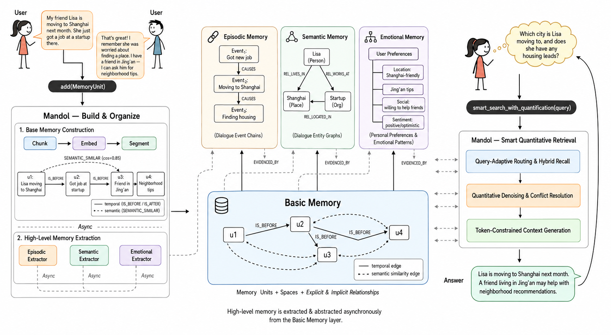

# Mandol

> Mandol: An In-Memory Agent Memory System

[](LICENSE)
[](https://www.python.org/)
[](https://pypi.org/project/mandol/)
[](https://pypi.org/project/mandol/)
[](https://agentcombo.github.io/Mandol)
[](https://agentcombo.github.io/Mandol/docs)
[](https://arxiv.org/abs/2606.29778)

[English](README.md) | [中文](README_CN.md)

> [!IMPORTANT]
> The `main` branch is under active refactoring and may differ from the released artifact. For exact paper reproduction, use the [`paper-repro`](https://github.com/AgentCombo/Mandol/tree/paper-repro) branch. The current public PyPI package [`mandol==0.1.0a1`](https://pypi.org/project/mandol/0.1.0a1/) and the GitHub release are built from, and aligned with, `paper-repro`.



---

## 📑 Table of Contents

<details>
<summary><b>Show/Hide</b></summary>

- [📖 What is Mandol?](#-what-is-mandol)
- [💡 Core Modules and Techniques](#-core-modules-and-techniques)
- [✨ Implementation](#-implementation)
- [🔬 Reproduction](#-reproduction)
- [⚡ Quick Start](#-quick-start)
- [📚 Documentation & Community](#-documentation--community)
- [📄 Citation](#-citation)
- [📄 License](#-license)

</details>

---

## 📖 What is Mandol?

Mandol is a native in-memory hierarchical memory system for LLM agents such as long-term conversational agents. Its core components are:

1. **Hierarchical Memory Model** — Organizes memory into a basic layer and a high-level abstract layer, both uniformly represented as a structured semantic graph with traceable relationships between all memory elements.
2. **In-Memory Semantic Data Structures** — Combines *SemanticMap* and *SemanticGraph* to natively fuse key-value, vector, and graph stores into a unified hybrid retrieval interface, eliminating cross-database I/O overhead.
3. **Smart Quantitative Retrieval** — A query-adaptive routing mechanism with two-stage denoising, conflict resolution, and token-constrained context generation — all operating without invoking LLMs during retrieval.

On the LoCoMo and LongMemEval long-term conversation benchmarks, Mandol achieves state-of-the-art accuracy of 92.21% and 88.40%, respectively. Compared to representative agent memory systems, Mandol delivers a 5.4× retrieval speedup and a 4.8× insertion speedup under 10 QPS concurrent load, while sustaining low latency on consumer-grade hardware. These results validate the system's effectiveness, efficiency, and stability in complex long-conversation scenarios.

**System-level comparison of agent memory systems:**

| System | Memory Organization | Storage | Retrieval | Search Latency |
|--------|---------------------|---------|-----------|----------------|
| Mem0 | Text vectors + metadata | VectorDB + metadata store | Vector semantic retrieval + metadata filtering | Medium |
| Zep | Text vectors + temporal knowledge graph | GraphDB + vector/full-text indexes | Multi-step graph traversal + reranking | High |
| MemOS | Text vectors + graph/tree summaries | VectorDB + GraphDB | Vector retrieval + graph node matching | High |
| EverMemOS | Text vectors + memory summaries | Multi-DB stack | Multi-turn retrieval + query rewriting | Very high |
| Mandol | Basic + high-level memories represented as a structured semantic graph | SemanticMap/Graph; DuckDB fallback | Hybrid recall + smart quantitative retrieval | Low |

**LoCoMo accuracy (%) comparison among different memory systems:**

<table>
<thead>
<tr>
<th>Backbone</th>
<th>System</th>
<th>Avg. Tok.</th>
<th>Single</th>
<th>Multi</th>
<th>Temp.</th>
<th>Open</th>
<th>Overall</th>
</tr>
</thead>
<tbody>
<tr>
<td rowspan="6"><i>GPT-4o-mini</i></td>
<td>Mem0</td><td>1.0k</td><td>66.71</td><td>58.16</td><td>55.45</td><td>40.62</td><td>61.00</td>
</tr>
<tr>
<td>MemU</td><td>4.0k</td><td>72.77</td><td>62.41</td><td>33.96</td><td>46.88</td><td>61.15</td>
</tr>
<tr>
<td>MemOS</td><td>2.5k</td><td>81.45</td><td>69.15</td><td>72.27</td><td>60.42</td><td>75.87</td>
</tr>
<tr>
<td>Zep</td><td>1.4k</td><td>88.11</td><td>71.99</td><td>74.45</td><td>66.67</td><td>81.06</td>
</tr>
<tr>
<td>EverMemOS<sup>†</sup></td><td>2.5k</td><td><u>91.68</u></td><td><u>82.74</u></td><td><u>79.34</u></td><td><strong>70.14</strong></td><td><u>86.13</u></td>
</tr>
<tr>
<td>Mandol (Ours)</td><td>2.0k</td><td><strong>93.82</strong></td><td><strong>85.11</strong></td><td><strong>89.10</strong></td><td>65.63</td><td><strong>89.48</strong></td>
</tr>
<tr>
<td rowspan="6"><i>GPT-4.1-mini</i></td>
<td>Mem0</td><td>1.0k</td><td>68.97</td><td>61.70</td><td>58.26</td><td>50.00</td><td>64.20</td>
</tr>
<tr>
<td>MemU</td><td>4.0k</td><td>74.91</td><td>72.34</td><td>43.61</td><td>54.17</td><td>66.67</td>
</tr>
<tr>
<td>MemOS</td><td>2.5k</td><td>85.37</td><td>79.43</td><td>75.08</td><td>64.58</td><td>80.76</td>
</tr>
<tr>
<td>Zep</td><td>1.4k</td><td>90.84</td><td>81.91</td><td>77.26</td><td>75.00</td><td>85.22</td>
</tr>
<tr>
<td>EverMemOS<sup>†</sup></td><td>2.3k</td><td><u>95.32</u></td><td><u>89.01</u></td><td><strong>90.13</strong></td><td><u>77.43</u></td><td><u>91.97</u></td>
</tr>
<tr>
<td>Mandol (Ours)</td><td>1.9k</td><td><strong>95.36</strong></td><td><strong>92.20</strong></td><td>87.85</td><td><strong>79.17</strong></td><td><strong>92.21</strong></td>
</tr>
</tbody>
</table>

> <sup>†</sup> Reproduced using the official implementation from EverMemOS.

Mandol achieves the highest Overall accuracy on LoCoMo under both backbone settings.

**LongMemEval accuracy (%) comparison among different memory systems:**

<table>
<thead>
<tr>
<th>Backbone</th>
<th>System</th>
<th>Avg. Tok.</th>
<th>SS-Pref</th>
<th>SS-Asst</th>
<th>Temporal</th>
<th>Multi-S</th>
<th>Know. Upd.</th>
<th>SS-User</th>
<th>Overall</th>
</tr>
</thead>
<tbody>
<tr>
<td rowspan="5"><i>GPT-4o-mini</i></td>
<td>MemU</td><td>0.5k</td><td>76.70</td><td>19.60</td><td>17.30</td><td>42.10</td><td>41.00</td><td>67.10</td><td>38.40</td>
</tr>
<tr>
<td>Mem0</td><td>1.1k</td><td><u>90.00</u></td><td>26.78</td><td>72.18</td><td>63.15</td><td>66.67</td><td>82.86</td><td>66.40</td>
</tr>
<tr>
<td>Zep</td><td>1.6k</td><td>53.30</td><td><u>75.00</u></td><td>54.10</td><td>47.40</td><td><u>74.40</u></td><td>92.90</td><td>63.80</td>
</tr>
<tr>
<td>MemOS</td><td>1.4k</td><td><strong>96.67</strong></td><td>67.86</td><td><u>77.44</u></td><td><u>70.67</u></td><td>74.26</td><td><u>95.71</u></td><td><u>77.80</u></td>
</tr>
<tr>
<td>Mandol (Ours)</td><td>2.1k</td><td><strong>96.67</strong></td><td><strong>98.21</strong></td><td><strong>78.95</strong></td><td><strong>74.44</strong></td><td><strong>88.46</strong></td><td><strong>97.14</strong></td><td><strong>85.00</strong></td>
</tr>
<tr>
<td rowspan="2"><i>GPT-4.1-mini</i></td>
<td>EverMemOS</td><td>2.8k</td><td><u>93.33</u></td><td><u>85.71</u></td><td><u>77.44</u></td><td><u>73.68</u></td><td><strong>89.74</strong></td><td><u>97.14</u></td><td><u>83.00</u></td>
</tr>
<tr>
<td>Mandol (Ours)</td><td>2.3k</td><td><strong>96.67</strong></td><td><strong>98.21</strong></td><td><strong>87.22</strong></td><td><strong>77.44</strong></td><td><strong>89.74</strong></td><td><strong>98.57</strong></td><td><strong>88.40</strong></td>
</tr>
</tbody>
</table>

Mandol achieves the highest Overall accuracy on LongMemEval under both backbone settings.

**Evaluation methodology.** Retrieval quality is measured via QA accuracy on the two benchmarks, defined as the percentage of questions whose generated answers are judged correct or semantically consistent with the ground-truth answers. Following the evaluation protocol of prior memory-system studies, GPT-4o-mini and GPT-4.1-mini serve as the answer-generation backbones, and we adopt the released LLM-based answer correctness evaluation script from EverMemOS.<br/>
Notably, rather than using large-parameter models such as Qwen3-Embedding-4B and Qwen3-Reranker-4B, we employ lightweight alternatives — Qwen3-Embedding-0.6B for embedding and bge-reranker-v2-m3 for reranking.


---

## 💡 Core Modules and Techniques

### (I) Hierarchical Memory Model

Memory is organized into a basic memory layer and a high-level abstract memory layer, both uniformly represented as a structured semantic graph.
The basic layer represents raw memory through memory units, spaces, and explicit/implicit relationships.
The abstract layer automatically derives episodic memory (event chains), semantic memory (entity graphs), and emotional memory (user preferences) from basic memories, with traceable links that ensure evidence grounding while supporting abstract reasoning.


### (II) In-Memory Semantic Data Structures

*SemanticMap* and *SemanticGraph* form a unified in-memory data structure that natively fuses key-value storage, vector indexes, and graph representations, eliminating multi-database fragmentation. Hybrid retrieval operators combine vector matching and graph traversal through a single API surface, removing the I/O latency inherent in heterogeneous storage architectures. The data structures also connect to an underlying persistent database for cold storage and long-term retention.


### (III) Smart Quantitative Retrieval Mechanism

The RAG-style recall-then-rank paradigm is replaced with a proactive pipeline of Query-Adaptive Routing, two-stage denoising and conflict resolution, and token-constrained context generation. Query-Adaptive Routing dynamically selects and queries the most relevant memory sources based on query intent. Two-stage quantitative denoising and conflict resolution then remove noise and contradictory information across sources. Finally, a compact high-quality context is assembled under token constraints by jointly optimizing relevance and diversity — all without LLM involvement in retrieval.


---

## ✨ Implementation
**Core APIs exposed by Mandol:**

| Scope | API |
|-------|-----|
| Memory unit operation | `add/delete/update(space, [unit])` |
| Explicit relationship | `add/delete/update_relationship(`<br>`unit_src, unit_target, [type])` |
| Unit retrieval | `search_unit(query, memory_space, type)` |
| Graph traversal | `traverse_explicit_nodes(unit, [type])` |
| Semantic traversal | `traverse_implicit_nodes(unit, [top_k])` |
| Quantitative retrieval | `smart_search_with_`<br>`quantification(query, [params])` |
| Persistence | `save_graph([dir, build_index])` |
| Memory construction | `build_memory_from_raw(sample_id,`<br>`extraction_style, [session_date])` |

### Memory Construction and Storage

When new content is inserted, the system automatically chunks, embeds, and segments the raw data. It extracts events and causal relationships to form episodic memory, entities and their relations to form semantic memory, and user preferences and long-term states to form emotional memory. These high-level memories coexist with the underlying base memories as the system's complete memory state.

### Memory Retrieval

Queries are served through the smart quantitative search API. For each query, Query-Adaptive Routing first allocates a token budget across memory spaces (basic, episodic, semantic, emotional). The system then performs algorithmic fusion, resolves conflicts, and selects high-quality memory entries within the assigned token budget.

### Memory Persistence
By default, Mandol keeps memory content in the in-memory SemanticMap/Graph to support low-latency retrieval. Mandol can also persist selected memory units and graphs for checkpointing, recovery, and later reloading into the in-memory runtime. Persistence can be triggered automatically by the runtime for database-backed checkpointing, while the save_graph API explicitly exports the current in-memory graph to local storage for
inspection, backup, or later restoration.

---

<!-- ## 📊 Comparison with Mainstream Memory Systems

The fundamental distinction between Mandol and existing memory systems lies in the retrieval paradigm: traditional systems treat retrieval as a unidirectional pipeline (embedding recall → rerank → top-K), where the process is passive and lacks explicit noise control. Mandol restructures this into a three-stage proactive retrieval pipeline — dynamically routing to the most relevant memory sources based on query intent, performing multi-level quantitative filtering and conflict resolution within and across sources, and finally generating high-information-density context under token constraints. This paradigm upgrade transforms retrieval from passive "match–return" to proactive "understand–filter–summarize."

At the architectural level, Mandol adopts a hexagonal architecture (ports-adapters pattern), fully decoupling core retrieval logic from underlying storage engines and enabling flexible switching from pure in-memory mode to external engines such as FAISS, Milvus, and Neo4j (see the optional backend dependencies under [Installation](#installation)).

> For detailed benchmark comparison data, see the performance table in the [What is Mandol?](#-what-is-mandol) section above.

--- -->
<!-- 
## 🏆 Application Cases

### Long Conversational Memory Benchmark: LoCoMo

On the LoCoMo benchmark (10 long-term conversations × 200+ turns, covering single-hop / multi-hop / temporal / open-domain queries), Mandol achieves the highest **multi-hop reasoning** score (92.20) among all systems. This is attributed to `SemanticGraph`'s explicit entity-relation graph and BFS graph expansion mechanism, which traverses along relational edges across multiple hops to discover indirectly connected evidence.

> When queried "How did Manager Zhang's decision last year affect the Q2 project delay this year?", Mandol traces along the event causal chain `Decision A → Team restructuring → Resource transfer → Project B delay → Q2 delivery postponed`, completing a 4-hop trace. In contrast, pure vector retrieval can only return isolated fragments containing keywords like "Manager Zhang" or "Q2."

### Long Memory Evaluation Benchmark: LongMemEval

LongMemEval emphasizes memory retention and knowledge update capabilities in multi-session scenarios. Mandol achieves near-perfect scores on assistant-side memory (SS-Asst 98.21) and user-side memory (SS-User 98.57), with a knowledge update score of 89.74 — when two versions of the same fact exist (old and new), the system accurately adopts the new information and resolves the conflict, validating the effectiveness of cross-session coreference resolution and the "prefer new information" strategy.

### Intelligent Customer Service

In multi-turn customer service dialogues, when a user asks "What can I do about the price drop on the blue shirt I bought yesterday?", the system must simultaneously correlate memories across three dimensions: **temporal events** (when the price drop occurred), **product attributes** (blue shirt SKU), and **user information** (purchase records, membership tier). Mandol directly pinpoints the specific order and applicable price protection policy through multi-dimensional associative queries, generating an accurate response such as "Your order qualifies for our price protection policy. A refund of ¥35 can be issued," thereby improving first-contact resolution rates.

### Software Development

When a developer requests "Analyze the correlation between payment module anomalies and features shipped this week," the relevant information is scattered across PR discussions, issue comments, changelogs, and design documents. Mandol performs parallel retrieval across four memory spaces (BASE / ENTITY / EVENT / SUMMARY), while `SemanticGraph` automatically constructs a module–function–developer–version association graph. The retrieval results encompass code changes, discussion context, and temporal associations, shortening root cause analysis from days to minutes.

### Healthcare

When a doctor requests "Provide emergency examination support for a patient with fever after taking aspirin," critical information is dispersed across cross-department medical records, medication histories, and examination reports. Mandol retrieves through entity relationship graphs, traces event causal chains, and acquires knowledge summaries, converging cross-department, cross-temporal scattered information into structured decision-support context within milliseconds, reducing the risk of cross-department information omission.

--- -->

## 🔬 Reproduction

The LoCoMo and LongMemEval results reported in the paper were produced with the
frozen [`paper-repro`](https://github.com/AgentCombo/Mandol/tree/paper-repro)
artifact. For faithful reproduction, clone that branch directly:

```bash
git clone --branch paper-repro --single-branch https://github.com/AgentCombo/Mandol.git
cd Mandol
```

Use the benchmark-specific instructions in the `paper-repro` branch:

- [LoCoMo reproduction](https://github.com/AgentCombo/Mandol/blob/paper-repro/benchmark_locomo/REPRODUCE.md)
- [LongMemEval reproduction](https://github.com/AgentCombo/Mandol/blob/paper-repro/benchmark_longmemeval/REPRODUCE.md)

The `main` branch and its `experimental/self_host_benchmarks/` workflows are under active refactoring
and are not the exact entry point used to produce the reported paper results.
Please obtain the datasets, configurations, and intermediate artifacts according
to the corresponding documentation in `paper-repro`.

## ⚡ Quick Start

### Installation

#### Released paper-repro package

The currently released PyPI package corresponds to the `paper-repro` branch:

```bash
pip install mandol==0.1.0a1
```

For the full paper reproduction environment, use the `paper-repro` source checkout and install the artifact stack with:

```bash
uv sync --extra dev --extra cuda --group spacy-model
```

If CUDA or flash-attention is not available on your platform, omit `--extra cuda`:

```bash
uv sync --extra dev --group spacy-model
```

#### Main branch optional backends

The following optional dependency groups are intended for the `main` branch development version and may not match the released `paper-repro` package:

```bash
pip install mandol[faiss]                 # FAISS vector index acceleration
pip install mandol[sentence-transformers] # Local Embedding/Reranker models
pip install mandol[openai]                # OpenAI API support
pip install mandol[milvus]                # Milvus vector database
pip install mandol[neo4j]                 # Neo4j graph database
pip install mandol[all]                   # Install all optional dependencies
```

> For exact paper reproduction, please use the [`paper-repro`](https://github.com/AgentCombo/Mandol/tree/paper-repro) branch.
> For complete installation guides, configuration details, and advanced usage, see the [online documentation](https://agentcombo.github.io/Mandol/docs).

### Configuration

Copy the environment variable template and fill in your API key:

```bash
cp .env.example .env
```

Or configure fully via a YAML configuration file:

```yaml
llm:
  model: "gpt-4o-mini"
  base_url: "https://api.openai.com/v1"
  api_key: "sk-..."

embedder:
  model: "Qwen/Qwen3-Embedding-0.6B"
  device: "cpu"
  use_remote: false

reranker:
  model: "BAAI/bge-reranker-v2-m3"
  # model: "Qwen/Qwen3-Reranker-4B"
  device: "cpu"
  use_remote: false

system:
  chunk_max_tokens: 512
  bfs_expansion_hops: 1
  max_context_units: 20
```

In remote API mode, no local model download (~8 GB) is needed — just set `use_remote` to `true` and configure the API endpoint to get started quickly.

### Three-Step Usage

```python
from mandol import MemorySystem, MemoryUnit, Uid

system = MemorySystem.from_yaml_config("config.yaml")

# 1. Write memories
system.add(MemoryUnit(
    uid=Uid("msg_001"),
    raw_data={"text_content": "Zhang San went to Beijing on a business trip today"},
    metadata={"timestamp": "2024-01-15T10:00:00"},
))

# 2. Build high-level memory structures
system.build_high_level(mode="auto")

# 3. Hybrid retrieval
hits = system.holistic_retrieve("Where did Zhang San go?", top_k=5)
for hit in hits:
    print(f"[{hit.final_score:.3f}] {hit.unit.raw_data['text_content']}")

system.save("./memory_snapshot")                        # Persist
system2 = MemorySystem.load("./memory_snapshot")        # Restore
```

> **Tip**: The system automatically detects session boundaries during `add()` and triggers high-level memory construction. After inserting a small batch of data, it is recommended to manually call `build_high_level()` to ensure high-level memories are populated. For further configuration options and advanced usage, see the [online documentation](https://agentcombo.github.io/Mandol/docs).

---

## 📚 Documentation & Community

### Documentation

Complete API reference, architecture design, and best practice guides are built with Sphinx and organized around three entry points — basic users, advanced users, and developers:

> 🔗 Online documentation: [https://agentcombo.github.io/Mandol/docs](https://agentcombo.github.io/Mandol/docs) (coming soon)

Build the documentation locally:

```bash
cd docs && make html
```

### Contributing

We welcome community contributions! Please read [CONTRIBUTING.md](CONTRIBUTING.md) before submitting a PR to learn about development environment setup, code standards (Ruff, 100-char line length), testing requirements, and the PR process.

### Feedback & Discussion

- **Issues**: [GitHub Issues](https://github.com/AgentCombo/Mandol/issues) — Report bugs or request new features
- **Discussions**: [GitHub Discussions](https://github.com/AgentCombo/Mandol/discussions) — Usage questions, best practice discussions
- **Community**: Scan the QR code below to join our WeChat user group


---

## 📄 Citation

If this work is helpful to your research, please cite our paper:

```bibtex
@misc{zhang2026mandol,
      title={Mandol: An Agglomerative Agent Memory System for Long-Term Conversations}, 
      author={Yuhan Zhang and Zhiyuan Guo and Ziheng Zeng and Wei Wang and Wentao Wu and Lijie Xu},
      year={2026},
      eprint={2606.29778},
      archivePrefix={arXiv},
      primaryClass={cs.DB},
      url={https://arxiv.org/abs/2606.29778}, 
}
```

---

## 📄 License

Apache License 2.0 — See [LICENSE](LICENSE)
